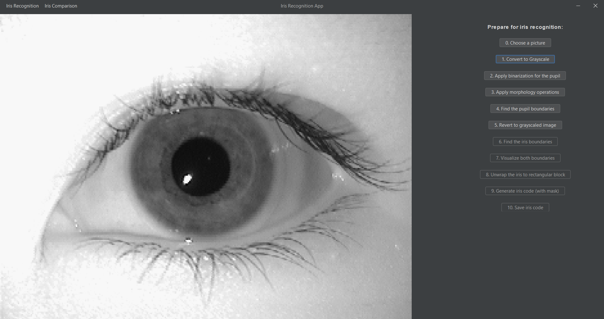
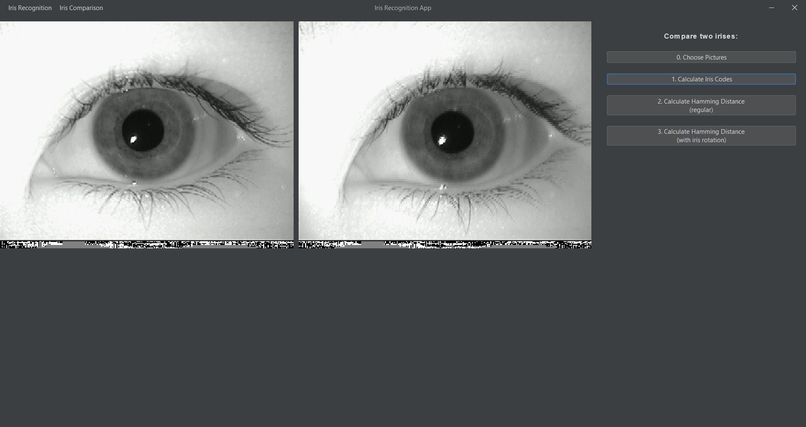
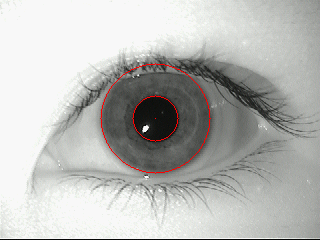
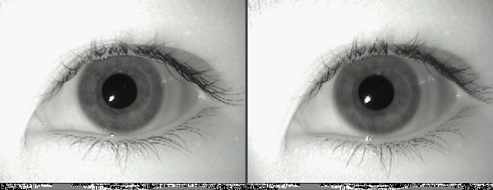

# Iris Recognition App

The project is a desktop application implemented in Java made for the Biometrics course during the sixth semester (2025/2026) at the Warsaw University of Technology. The purpose of the app is iris recognition: it enables the generation of iris codes from standard eye photographs. A key feature is visually demonstrating each processing stage needed to achieve the final result. Moreover, the application allows for the direct comparison of two separate eye photos by analyzing their corresponding codes. Consequently, it proves to be a reliable solution for human identification. Full documentation is available in the [Documentation.pdf](Documentation.pdf) file. The application has two main functionalities: Iris Recognition and Iris Comparison, which are described in separate sections below. 

## App UI

## Iris Recognition
The application utilizes the Daugman Algorithm: it starts from a picture of an eye, determines the pupil and iris boundaries, unwraps the iris into a rectangle, and calculates an iris code based on that. The user can apply the steps one-by-one; their results are also visualised, and some examples can be seen on the images below. 

## Iris Comparison
The user can also use the app to compare between two eye pictures to determine whether they contain the same eye. To do that, they calculate the iris codes of both eyes, later comparing the Hamming Distance between them using one of two algorithm versions. 

---
### Authors

- [Martyna Sadowska](https://github.com/Martyna-265)
- [Hanna Szczerbińska](https://github.com/zabolot7)
